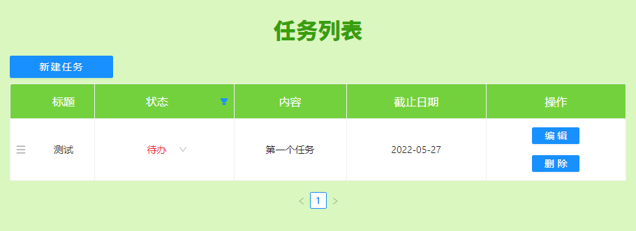

# :green_book: vite-task-list

使用 vite+react 实现的任务列表。任务列表的增删改查。

- [页面效果](#页面效果)
- [运行](#运行)
- [在线体验](#在线体验)

---

## :spider_web: 页面效果



## :running_man: 运行

安装：

```sh
npm install
```

<br/>

运行：

```sh
vite
```

## :triangular_flag_on_post: 在线体验

[任务列表](https://dongdanyan-tasklist.netlify.app/)
